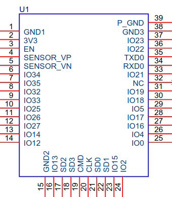
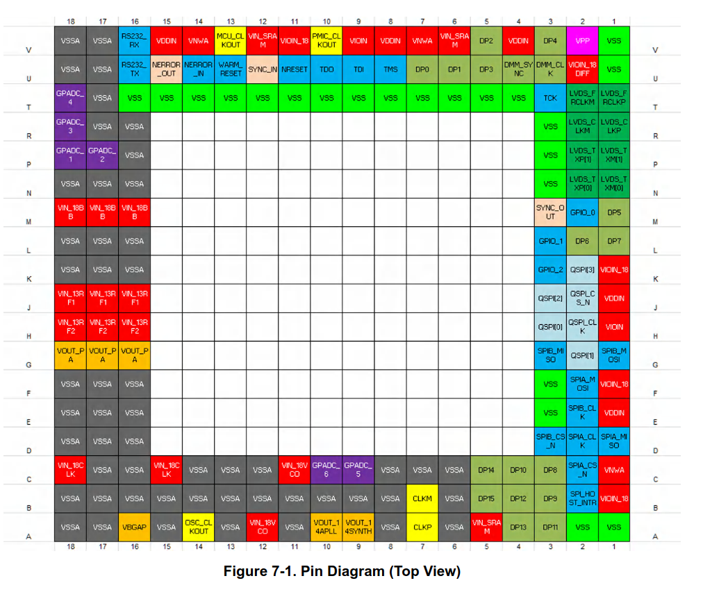

# Aqara FP2

I spent some time a while ago reverse engineering parts of the Aqara FP2. This repo contains my notes/resources so far.

## Protocol

The IWR communicates with the ESP over the UART link. This is the primary connection between the two devices.

See [PROTOCOL.md](PROTOCOL.md) for a description of the protocol over the UART link.

## Scripts

This repo contains a few useful scripts:
* `sniff_uart_bidir.py` - Uses a `glasgow` to sniff bidirectional uart communication between the ESP32 and IWR (Radar) chips.
* `test_decode.py` - Script which implements a decoder for `PROTOCOL.md`, decodes files with sniffed protocol dumps.

## Hardware

I have based a lot of this off measurements and tracing a board with some chips removed. See `board_reveng.svg` for my annotations. I would recommend opening this file in Inkscape.

### Chips
* Radar SOC: IWR6843AOP
* Radar Flash (?): WinBond 25Q64JVIQ
* MCU: ESP32-WROOM-32U
* SRAM: AP MEMORY 1604M-3SQR
* ACCEL: Possibly MEMSIC MC3630?

### Pinouts

#### Edge FFC connector

This is a (unpopulated in my device) 10 pin FFC connector on the edge of the board. It is connected to the LVDS output interface on the IWR, which can be configured to dump raw radar data.

* 1 - `LVDS_TXM[1]`
* 2 - `LVDS_TXP[1]`
* 3 - `LVDS_TXM[0]`
* 4 - `LVDS_TXP[0]`
* 5 - `LVDS_CLKM`
* 6 - `LVDS_CLKP`
* 7 - `LVDS_FRCLKM`
* 8 - `LVDS_FRCLKP`
* 9 - `GND`
* 10 - Some voltage, 3.3V?

#### P2 Connector 

This set of test points are connected to the radar soc flash chip. Presumably used for programming in the factory.

* 1 - `QSPI_CS`
* 2 - `QSPI_IO1`
* 3 - `QSPI-IO2`
* 4 - `GND`
* 5 - `QSPI_IO0`
* 6 - `QSPI_CLK`
* 7 - `QSPI_IO3`
* 8 - `VCC`

#### Test points

These are connected to the test points on the board. I am reasonably confident I have all test points connected to the IWR pads noted down.

* `TP1` - L1,DP7
* `TP2` - ???
* `TP3` - ???
* `TP4` - 5V
* `TP5` - ???
* `TP6` - 3.3V
* `TP7` - 1.8V
* `TP8` - ???
* `TP9` - ???
* `TP10` - GND
* `TP11` - 1.2V
* `TP12` - 1V
* `TP13` - ???
* `TP14` - ???

* `TP16` - E2 / SPIB_CLK
* `TP17` - ???
* `TP18` - ???
* `TP19` - ???
* `TP20` - G1 / SPIB_MOSI
* `TP21` - G3 / SPIB_MISO
* `TP22` - SYNC_OUT
* `TP23` - ???
* `TP24` -
* `TP40` - LED
* `TP41` - LED
* `TP42` - LED
	 
#### ESP32 module pinout

* 1 - GND
* 2 - 3V3
* 3 - EN - NC?
* 4 - SENSOR_VP - USER_SWITCH
* 5 - SENSOR_VN - ???? NC?
* 6 - IO34 - Accel Interrupt
* 7 - IO35 - Light sensor
* 8 - IO32 - Light sensor
* 9 - IO33 - Light sensor
* 10 - IO25 - ????
* 11 - IO26 - LED
* 12 - IO27 - LED
* 13 - IO14 - LED
* 14 - IO12 - ???? NC?
* ==
* 15 - GND
* 16 - IO13 - RAD U11 / NRESET
* 17 - SRAM
* 18 - SRAM
* 19 - R
* 20 - R
* 21 - SRAM
* 22 - SRAM
* 23 - IO15 - ???? NC?
* 24 - IO2 - Strapping Pin - TP38
* ==
* 25 - IO0 - Strapping Pin - TP28
* 26 - IO4 - ???? NC?
* 27 - IO16 - SRAM_CS
* 28 - IO17 - ????
* 29 - IO5 - ???? NC?
* 30 - IO18 - RAD U16 / RS232_TX
* 31 - IO19 - RAD V16 / RS232_RX
* 32 - NC
* 33 - IO21 - ????
* 34 - RXD0 - TP9
* 35 - TXD0 - TP8
* 36 - IO22 - ???? NC?
* 37 - IO23 - ???? NC?
* 38 - GND

#### IWR chip

See `board_reveng.svg`, open in inkscape.

## ESP32 Firmware

